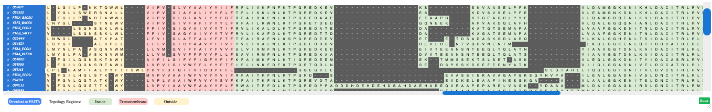

# TM-MSAligner
## A Multi-Objective Multiple Sequence Alignment Tool for Transmembrane Proteins

Impact of the Software TM-MSAligner applied to BAlibase Ref7

## Requirements
To use TM-MSAligner the following software packages are required:
* [Java SE Development Kit 8](http://www.oracle.com/technetwork/java/javase/downloads/jdk8-downloads-2133151.html?ssSourceSiteId=otnes)
* [Apache Maven](https://maven.apache.org/)
* [Git](https://git-scm.com/)

## Downloading and compiling

## Results

Visualizations of Pareto Front Solutions and Alignments

Ilustrating  Solution X:


Ilustrating  Solution X:


## Runing M2Align

## Commands to precompute alignments (needed for generating the initial population)
Assuming that the FASTA file containing the sequences to align is named "FASTA_FILE", the sintax to run the different tools are:
```
clustalw2 -infile=FASTA_FILE -outfile=FASTA_FILE_clu" -output=FASTA -ALIGN -QUIET -OUTORDER=input
mafft --auto --inputorder --quiet FASTA_FILE > FASTA_FILE_mafft
t_coffee FASTA_FILE -output fasta
muscle -in FASTA_FILE -fastaout FASTA_FILE_muscle" -quiet
java -jar /usr/local/bin/retalign.jar -out FASTA_FILE_retalign" FASTA_FILE
kalign -c input -f fasta -q -i FASTA_FILE -o FASTA_FILE_kalign
probcons FASTA_FILE > FASTA_FILE_probcons
fsa --refinement 100 FASTA_FILE > FASTA_FILE_fsa
