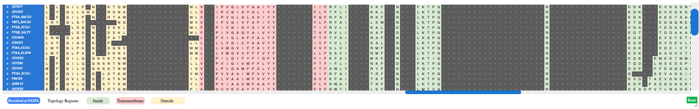
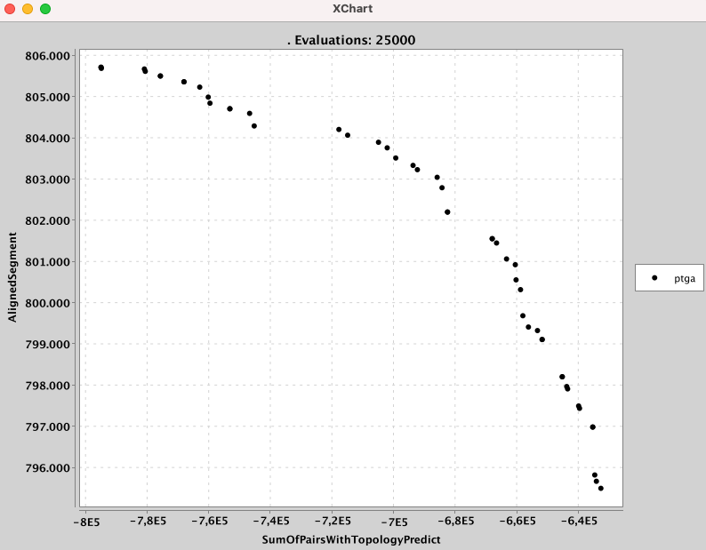

# TM-MSAligner
## A Multi-Objective Multiple Sequence Alignment Tool for Transmembrane Proteins

TM-MSAligner is a multiobjective software tool to align multiple transmembrane protein sequences (TMPs)
based on the [M2Align](https://github.com/KhaosResearch/M2Align) software. The core of TM-MSAligner is a multi-objective evolutionary algorithm based combining features of the reference algorithms NSGA-II and SPEA2. TM-MSAAligner provides an encoding  for representing MSA solutions and its corresponding mutation and crossover operators, and it is able of reducing the computing time by exploiting the computing capabilities of common multi-core CPU computers

Impact of the Software TM-MSAligner applied to BAlibase Ref7

## Requirements
To use TM-MSAligner the following software packages are required:
* [Java SE Development Kit 8](http://www.oracle.com/technetwork/java/javase/downloads/jdk8-downloads-2133151.html?ssSourceSiteId=otnes)
* [Apache Maven](https://maven.apache.org/)
* [Git](https://git-scm.com/)

## Downloading and compiling
To download TM-MSAligner just clone the Git repository hosted in GitHub:
```
git clone https://github.com/cristianzambrano/TM-MSAligner.git
```
Once cloned, you can compile the software and generate a jar file with the following command:

```
mvn package
```

This sentence will generate a directory called `target` which will contain a file called `tm-msaligner-1.0-SNAPSHOT-jar-with-dependencies.jar`

## Generate the Transmembrane Topology Prediction using the DeepTMHMM tool

With the aim to predict the membrane topology of both alpha-helical and beta-barrel transmembrane proteins, we have used [DeepTMHMM](https://dtu.biolib.com/DeepTMHMM), a Deep Learning Model for Transmembrane Topology Prediction and Classification. 
This tool requires one or more proteins in FASTA format and generate the results with a file in `.3line` format.

The first line contains the Sequence Name, the second line the sequence and teh third line the topology prediction information. Each letter represents the type of topology: I: inside, O: outside and M: membrane.

For example:

``` 
>MSCL_ECOLI | TM
MSIIKEFREFAMRGNVVDLAVGVIIGAAFGKIVSSLVADIIMPPLGLLIGGIDFKQFAVTLRDAQGDIPAVVMHYGVFIQNVFDFLIVAFAIFMAIKLINKLNRKKEEPAAAPAPTKEEVLLTEIRDLLKEQNNRS
IIIIIIIIIIIIIIIIIIMMMMMMMMMMMMMMMMMMMMMMMMMMMMMMOOOOOOOOOOOOOOOOOOOOOOOOOOOOMMMM
``` 

## Generate list of pre-computed alignments (needed for generating the initial population)
To generate the Initial population of our algorithm, TM-MSAligner requires a list of pre-computed alignments. This list can be generated 
by the state-of-the-art MSA software tools. 
Assuming that the FASTA file containing the sequences to align is named "FASTA_FILE", the commands to run the different tools are:

ClustalW2
```
clustalw2 -infile=FASTA_FILE -outfile=FASTA_FILE_clu" -output=FASTA -ALIGN -QUIET -OUTORDER=input
```
Mafft
```
mafft --auto --inputorder --quiet FASTA_FILE > FASTA_FILE_mafft
```
T_Coffee
```
t_coffee FASTA_FILE -output fasta
```
Muscle
```
muscle -in FASTA_FILE -fastaout FASTA_FILE_muscle" -quiet
```
Kalign
```
kalign -c input -f fasta -q -i FASTA_FILE -o FASTA_FILE_kalign
```
Probcons
```
probcons FASTA_FILE > FASTA_FILE_probcons
```
Fsa
```
fsa --refinement 100 FASTA_FILE > FASTA_FILE_fsa
```

## Runing TM-MSAligner

### Running TM-MSAligner to align a custom TMPs sequences dataset
To execute the TM-MSAligner algorithm to align a custom dataset of sequences, just run this command:

``` java
java -cp target/tm-msaligner-1.0-SNAPSHOT-jar-with-dependencies.jar org.tm_msaligner.TM_M2Align_Runner dataDirectory problemName NumberOfEvaluations PopulationSize NumberOfCores typeObserver 
```

* dataDirectory: The path of the data directory. This directory must contain two components. First, the file with the TMPs sequences and the topology prediction information, called `problemName_predicted_topologies.3line` (See how generate this file in above section).
And second, the Pre-Computed alignments files in FASTA format (`.fasta` extension) performed by state-of-the-art of MSA software. These pre-computed alignments are used to generate the Initial population of the algorithm.
The algorithm search files with extension `.fasta` and add to the list. See details how to generate them in the above section.
* problemName: Name of the custom TMP Sequences dataset.
* NumberOfEvaluations: Number of the maximun evaluations of the algorithm.
* PopulationSize: Size of the population of the algorithm.
* NumberOfCores: Number of cores to use for the parallel execution of the algorithm.
* observerType: Type of the Observer added to the algorithm. TM-MSAligner includes three different observers to plot the performance of the algorithm, use the following values:  0 -> None, 1 -> FitnessWriteFileObserver, 2 -> FitnessPlotObserver and 3 -> FrontPlotTM_MSAObserve. See details of each observer in the section below.

An example to align a custom TMPs dataset called `msl` stored in the folder `data/custom_tests`, with 25000 evaluations of the algorithm, a population size of 100, using 4 cores and plotting the ParetoFront every each 500 evaluations,
you have to run this command:

``` java
java -cp target/tm-msaligner-1.0-SNAPSHOT-jar-with-dependencies.jar org.uma.khaos.tm_msaligner.TM_M2Align_Runner data/custom_tests/ msl 25000 100 4 3
```

The results are saved in the folder called as: `dataDirectory`/results_`currentSystemTimeMilliseconds`/. See more details about the results generated by our software in the next section.

### Runing TM-MSAligner to align a TMPs instance from BAliBASE benchmark
To test the performance of our software, we have used some multiple sequence alignment (MSA) benchmarkings, one of them, is the reference 7 of BAliBASE (Benchmark Alignment dataBASE), 
this dataset is made of 435 alpha-helical TMPs classified into 8 distinct families named: 7tm, msl, ion, acr, nat, dtd, photo and ptga.

We have added the BAliBASE-ref7 dataset in our [data](https://github.com/cristianzambrano/TM-MSAligner/tree/main/data) folder. 
In this folder we have added the pre-computed alignments performed by state-of-the-art of MSA software: ClustalW, KAlign, TM-TCoffee, Muscle, Mafft, T-Coffee.
Furthermore, we have added the `refName`_predicted_topologies.3line for each BAliBASE-ref7 instance, saved in the data/benchmarks/ref7 folder.

To execute the algorithm to solve a problem of the BAliBASE TMP's benchmark (ref7), just run this command:

``` java
java -cp target/tm-msaligner-1.0-SNAPSHOT-jar-with-dependencies.jar TM_M2AlignBAliBASETest_Runner balibaseInstanceName dataDirectory NumberOfEvaluations PopulationSize NumberOfCores
```
* balibaseInstanceName: the BAliBASE ref7 instance name.
* observerType: Type of the Observer added to the algorithm. TM-MSAligner includes three different observers to plot the performance of the algorithm, use the following values:  0 -> None, 1 -> FitnessWriteFileObserver, 2 -> FitnessPlotObserver and 3 -> FrontPlotTM_MSAObserve. See details of each observer in the next section.

Solving BAliBASE-ref7 benchmarking, TM-MSAligner considers the following pathfolders:

* benchmarkPath: Directory with the original BAliBASE-ref7 sequences without align and the predicted_topologies.3line file, the path is joined as follows 'data/benchmarks/ref7/' + `balibaseInstanceName` + '/'
* dataFile: The filename of the original TMP sequences of BAliBASE instance, 'benchmarkPath' + `balibaseInstanceName` + '_predicted_topologies.3line'
* preComputedMSAPath: Directory with the PreAlignments, TM-MSAligner reads all `.fasta` extension files stored in this folder, the path is joined as follows 'data/precomputed_solutions/ref7/' + `balibaseInstanceName` +'/'

The results are saved in the folder called as: data/tests/ref7/`balibaseInstanceName`/results_`currentSystemTimeMilliseconds`/. See more details about the results generated by our software in the next section.

### Running TM-MSAligner in Parallel
To speed-up the execution of TM-MSAligner, two parallel schemes are provided: synchronous and asynchronous. In the 


## Results

### Final Pareto Front and Alignments

The software generates the FUN file with the Pareto Front points (solutions) called: FUN_`problemName`.tsv, each point represents one alignment,
whose are illustrated with the MSA HTML viewer called [MSABrowser](https://thekaplanlab.github.io/), the alignments are saved as: MSASol.html. 
Finally, the main html page with the plot of the Pareto Front and the Solutions viewer is generated as resultsMSA_`problemName`.html
We illustrated some screenshots of the results, with the selection of different alignments (points) in the Pareto Front:

<h3><b>Solutions for BAliBASe Ref7 Instance _ptga_</b></h3>
Selection of one Non-dominated solution of the Pareto Front<br>
<div style="text-align: center;"></div>
Visualization of the solution selected (MSA)


Selection of the second one Non-dominated solution of the Pareto Front<br>
<div style="text-align: center;"></div>
Visualization of the solution selected (MSA)<br>


Selection of the third one Non-dominated solution of the Pareto Front<br>
<div style="text-align: center;"></div>
Visualization of the solution selected (MSA)<br>


### Pareto Front Observer
In this example, solving the `ptga` instance of the BAliBASE-ref7 instance, the software plot the evolution of the Pareto-Front generated by our algorithm TM-MSAligner,
the next figures, illustrates the Pareto-Fronts during different number of evaluations.

<table style="border:0px">
<tr><td colspan="2"><b>Different Pareto-Fronts</b></td></tr>

<tr>
<td>1000 Evaluations<br>

</td>
<td>3500 Evaluations<br>

</td>
</tr>
<tr>
<td>13000 Evaluations<br>

</td>
<td>25000 Evaluations<br>

</td>
</tr>
</table>


### Fitness evolution Observer

In this example, solving the `msl` instance of the BAliBASE-ref7 instance, the software generated the file `BestScores_msl.tsv` with the evolution of both fitness scores
implemented in our algorithm TM-MSAligner, the results are illustrated in the following pictures:

<table style="border:0px">
<tr><td colspan="2"><b>Evolution of the Fitness Scores</b></td></tr>
<tr>
<td><b>Sum-Of_Pair with Topology Prediction Score</b><br>

</td>
<td><b>Aligned Segments Score</b><br>

</td>
</tr>
</table>


## Finding algorithm configurations with irace
We explain in this section the steps needed to use TM-MSAligner in combination with irace, a tool for automatic algorithm configuration (NOTE: experience with irace is a pre-requisite for understanding this section). All the needed stuff is stored in the `resources/irace` folder.

The contents of the `irace` folder is the following:

* `data`: a copy of the `data` folder of the project.
* `instances-list.txt`: a text file containing the name of the instances used as training set as well as the name of the file containing their reference fronts. The file currently contains the `msl` instance:
``` 
msl --referenceFrontFileName msl.csv
```
* `irace_3.5.1.tar.gz`: the irace package
* `parameters.txt`: a text file containing the parameter space in the irace format (note that parameters `populationSize` and `maximumNumberOfEvaluations` are included in the first two lines of the file):
```
maximumNumberOfEvaluations               "--maximumNumberOfEvaluations "           o     (10000)  
populationSize                           "--populationSize "           o         (50)  
algorithmResult                          "--algorithmResult "                     c       (externalArchive, population)                      
populationSizeWithArchive                "--populationSizeWithArchive "           i       (10, 200)                      | algorithmResult %in% c("externalArchive")
externalArchive                          "--externalArchive "                     c       (crowdingDistanceArchive, hypervolumeArchive, unboundedArchive) | algorithmResult %in% c("externalArchive")
#
ranking                                  "--ranking "                             c       (dominanceRanking, strengthRanking)                     
#
densityEstimator                         "--densityEstimator "                    c       (crowdingDistance, knn)                            
kValueForKNN                             "--kValueForKNN "                        i       (1, 3)                         | densityEstimator %in% c("knn")
#
variation                                "--variation "                           c       (crossoverAndMutationVariation)                     
offspringPopulationSize                  "--offspringPopulationSize "             i       (1, 400)                       | variation %in% c("crossoverAndMutationVariation")
crossover                                "--crossover "                           c       (SPX)                          | variation %in% c("crossoverAndMutationVariation")
crossoverProbability                     "--crossoverProbability "                r       (0.0, 1.0)                     | crossover %in% c("SPX")
mutation                                 "--mutation "                            c       (insertRandomGap, mergeAdjuntedGapsGroups, shiftClosedGaps, splitANonGapsGroup) | variation %in% c("crossoverAndMutationVariation")
mutationProbabilityFactor                "--mutationProbabilityFactor "           r       (0.0, 2.0)                     | mutation %in% c("insertRandomGap","mergeAdjuntedGapsGroups","shiftClosedGaps","splitANonGapsGroup")
#
selection                                "--selection "                           c       (tournament, random)                               
selectionTournamentSize                  "--selectionTournamentSize "             i       (2, 10)                        | selection %in% c("tournament")
```
* `run.sh`: script to run irace. Parameters such as the number of cores to use are included in this file.
* `scenario`: folder that contains the `scenario.txt` file needed by irace. The files generated by irace will be stored here.
* `resources`: folder containing the reference fronts (in CSV format) of the instances using for training.

The steps to run irace are the following:

1. Execute `mvn package` in the root directory of the project. As a result, the file called `TM-MSAligner-1.0-jar-with-dependencies.jar` will be generated in the `target` directory. This file has to be copied to `irace` directory.
2. Run irace:
```bash
./run.sh scenarios/scenario.txt 1
```
3. The output of the irace execution will be stored in the directory `scenarios/execdir-1`. The best found configurations are written at the end of the file `irace.stdout.txt`. An example is shown next:
```
# Best configurations as commandlines (first number is the configuration ID; listed from best to worst according to the sum of ranks):
112 --maximumNumberOfEvaluations 10000 --populationSize 50 --algorithmResult externalArchive --populationSizeWithArchive 149 --externalArchive hypervolumeArchive --ranking dominanceRanking --densityEstimator crowdingDistance --variation crossoverAndMutationVariation --offspringPopulationSize 201 --crossover SPX --crossoverProbability 0.8054 --mutation mergeAdjuntedGapsGroups --mutationProbabilityFactor 1.8994 --selection tournament --selectionTournamentSize 9
71  --maximumNumberOfEvaluations 10000 --populationSize 50 --algorithmResult externalArchive --populationSizeWithArchive 69 --externalArchive hypervolumeArchive --ranking strengthRanking --densityEstimator crowdingDistance --variation crossoverAndMutationVariation --offspringPopulationSize 111 --crossover SPX --crossoverProbability 0.9687 --mutation mergeAdjuntedGapsGroups --mutationProbabilityFactor 1.8188 --selection tournament --selectionTournamentSize 7
95  --maximumNumberOfEvaluations 10000 --populationSize 50 --algorithmResult externalArchive --populationSizeWithArchive 146 --externalArchive hypervolumeArchive --ranking dominanceRanking --densityEstimator crowdingDistance --variation crossoverAndMutationVariation --offspringPopulationSize 178 --crossover SPX --crossoverProbability 0.9186 --mutation mergeAdjuntedGapsGroups --mutationProbabilityFactor 1.9294 --selection tournament --selectionTournamentSize 6
129 --maximumNumberOfEvaluations 10000 --populationSize 50 --algorithmResult externalArchive --populationSizeWithArchive 114 --externalArchive hypervolumeArchive --ranking strengthRanking --densityEstimator crowdingDistance --variation crossoverAndMutationVariation --offspringPopulationSize 139 --crossover SPX --crossoverProbability 0.9293 --mutation mergeAdjuntedGapsGroups --mutationProbabilityFactor 1.8636 --selection tournament --selectionTournamentSize 7
77  --maximumNumberOfEvaluations 10000 --populationSize 50 --algorithmResult externalArchive --populationSizeWithArchive 149 --externalArchive hypervolumeArchive --ranking strengthRanking --densityEstimator crowdingDistance --variation crossoverAndMutationVariation --offspringPopulationSize 50 --crossover SPX --crossoverProbability 0.9582 --mutation mergeAdjuntedGapsGroups --mutationProbabilityFactor 1.7155 --selection tournament --selectionTournamentSize 5
```
4. Select one of the configurations, remove the first element (the number is an id for irace that is not needed), and add at the beginning the parameters `ProblemName`, `referenceFrontFileName`, and `randomGeneratorSeed`. With the resulting string, just execute the following command from the project root directory:
``` bash
java -cp target/TM-MSAligner-1.0-jar-with-dependencies.jar org.tm_msaligner.auto.algorithm.ConfigurableTMMAlignerRunner --problemName msl --referenceFrontFileName data/referenceFronts/msl.csv --maximumNumberOfEvaluations 10000 --populationSize 50 --algorithmResult externalArchive --populationSizeWithArchive 149 --externalArchive hypervolumeArchive --ranking dominanceRanking --densityEstimator crowdingDistance --variation crossoverAndMutationVariation --offspringPopulationSize 201 --crossover SPX --crossoverProbability 0.8054 --mutation mergeAdjuntedGapsGroups --mutationProbabilityFactor 1.8994 --selection tournament --selectionTournamentSize 9
```

The output of TMMSAliger will be stored in the files `VAR.csv` (the aligments) and `FUN.csv` (the values of the scores).


